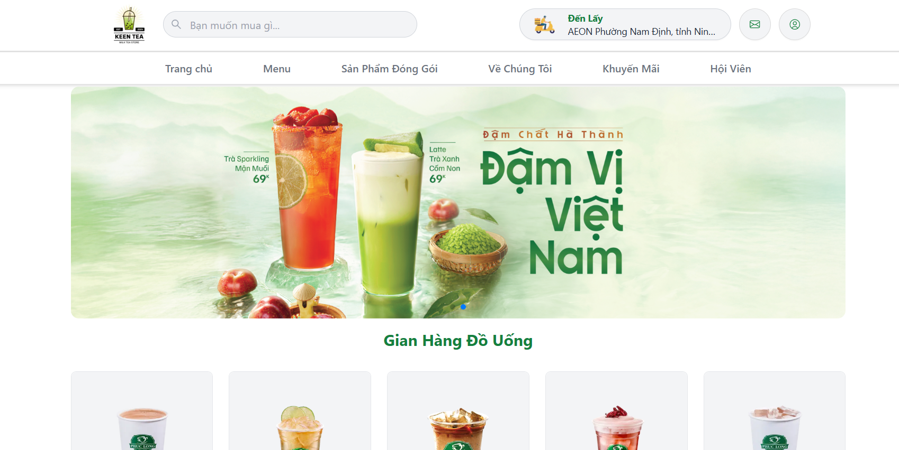
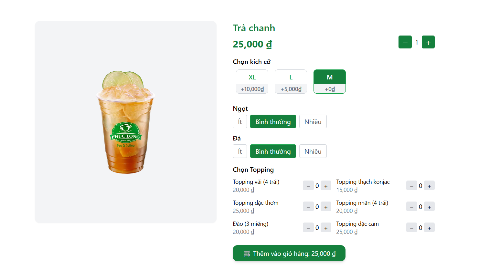
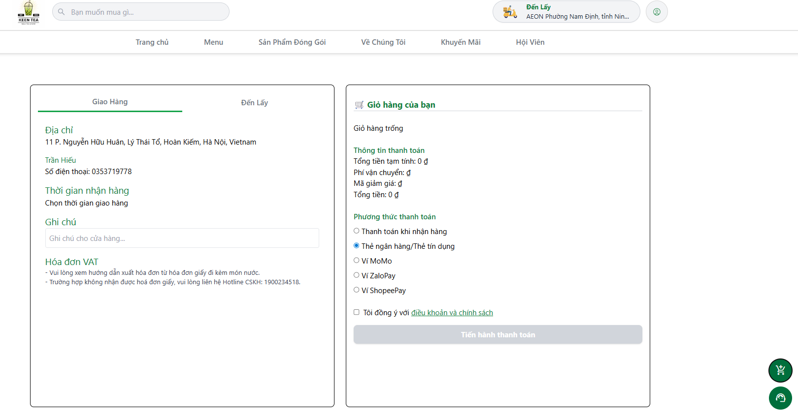
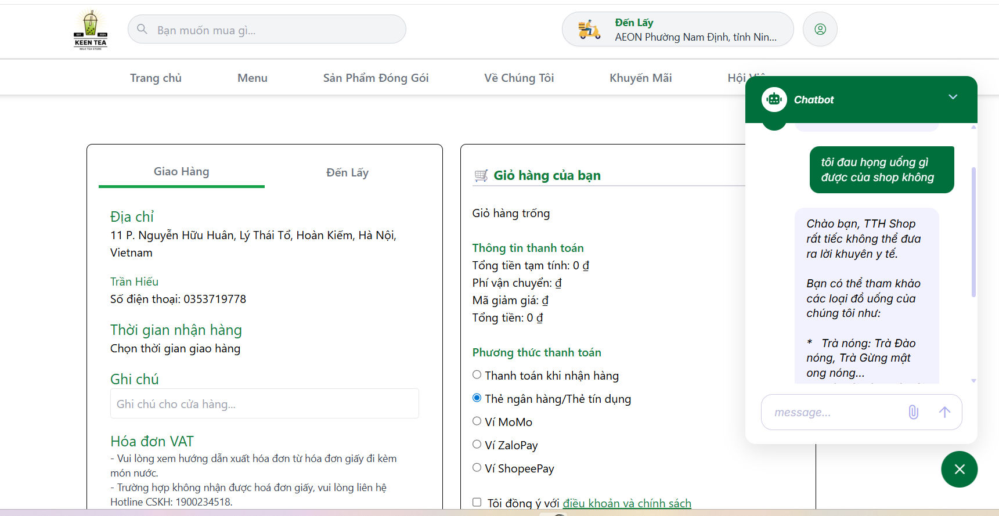

#  Hệ Thống Thương Mại Điện Tử Tích Hợp Trợ Lý Ảo (AI Chatbot E-commerce)

Một nền tảng thương mại điện tử hiện đại chuyên cung cấp các mặt hàng ẩm thực (món ăn, đồ uống), được tích hợp trợ lý ảo thông minh nhằm nâng cao trải nghiệm mua sắm và hỗ trợ khách hàng tự động.

##  Công Nghệ Sử Dụng (Tech Stack)

* **Frontend:** React, Next.js
* **Backend:** Node.js (Express.js)
* **Database:** MongoDB
* **AI/Chatbot:** Prompt Engineering Architecture
* **Authentication:** JSON Web Tokens (JWT)

##  Chức Năng Chính (Key Features)

### 1. Trải Nghiệm Khách Hàng (User Experience)
* **Giao diện trực quan:** Trang chủ hiển thị danh sách món ăn, đồ uống sinh động kèm hình ảnh, giá cả và mô tả chi tiết.
* **Quy trình mua sắm chuẩn:** Đầy đủ các tính năng bao gồm:
    * Tìm kiếm và lọc sản phẩm.
    * Xem chi tiết sản phẩm.
    * Quản lý giỏ hàng (Thêm, sửa, xóa).
    * Thanh toán đơn hàng nhanh chóng.

### 2. Trợ Lý Ảo Thông Minh (AI Chatbot)
* **Hỗ trợ 24/7:** Chatbot được xây dựng dựa trên kiến trúc **Prompt Engineering**, giúp tối ưu hóa luồng hội thoại.
* **Giao diện thân thiện:** Tích hợp trực tiếp vào web với cửa sổ chat dễ sử dụng.
* **Cá nhân hóa:** Hỗ trợ tư vấn món ăn, giải đáp thắc mắc và hướng dẫn người dùng mua hàng hiệu quả.

### 3. Hệ Thống Tài Khoản & Bảo Mật (Auth & Security)
* **Phân quyền rõ ràng:** Hỗ trợ nhiều vai trò bao gồm Người dùng (User) và Quản trị viên (Admin).
* **Xác thực bằng Token:** * Sử dụng JWT để cấp token xác minh người dùng.
    * Duy trì phiên đăng nhập an toàn, giúp giảm tần suất yêu cầu đăng nhập lại, mang lại sự liền mạch cho người dùng.

### 4. Quản Trị Hệ Thống (Admin Dashboard)
* Quản lý danh sách sản phẩm (thêm, sửa, xóa món ăn/đồ uống).
* Quản lý đơn hàng và trạng thái thanh toán.
* Quản lý thông tin người dùng.

##  Kiến Trúc Hệ Thống

[Image of e-commerce web application architecture diagram]

*Hệ thống được chia thành 3 lớp chính: Client (Next.js/React), API Server (Node.js) xử lý logic nghiệp vụ và giao tiếp với Chatbot Engine, và Database (MongoDB) lưu trữ dữ liệu.*

## Giao diện Trang chủ
Đây là giao diện chính hiển thị danh sách các món ăn và đồ uống:

Đây là giao diện giao diện chi tiết sản phẩm:

Đây là giao diện giao thanh toán sản phẩm:

Đây là giao diện chatbot hỗ trợ khách hàng:

